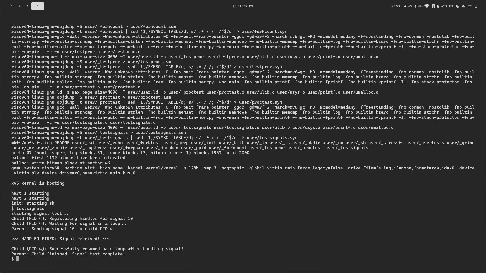
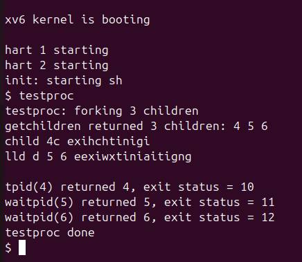
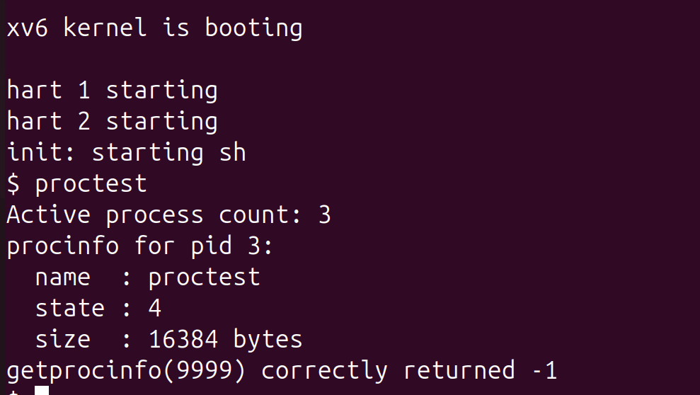
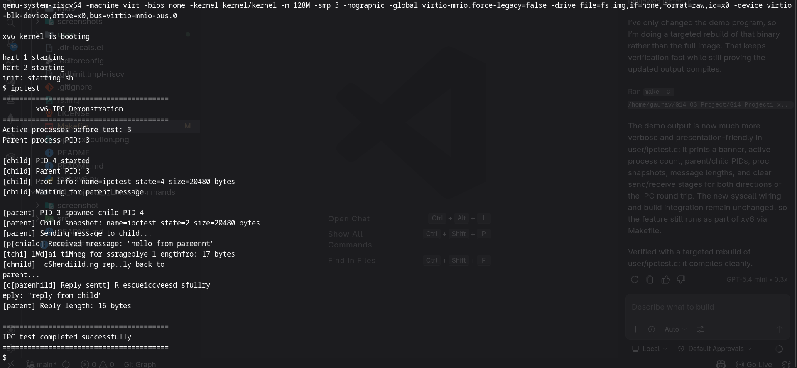
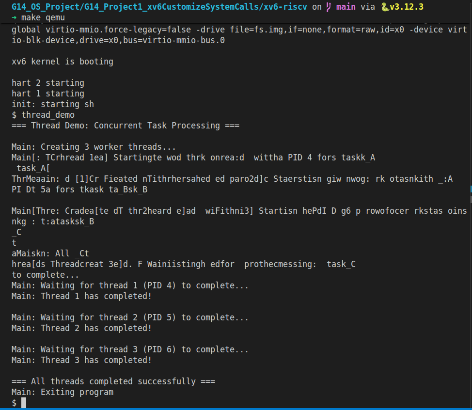
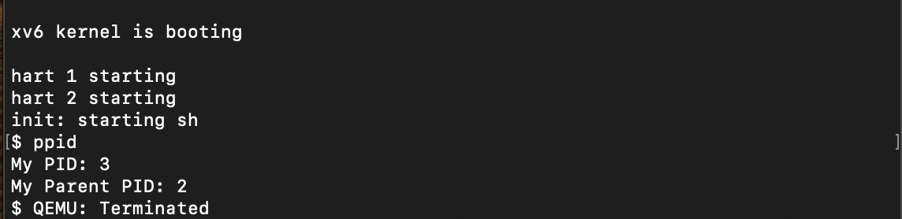
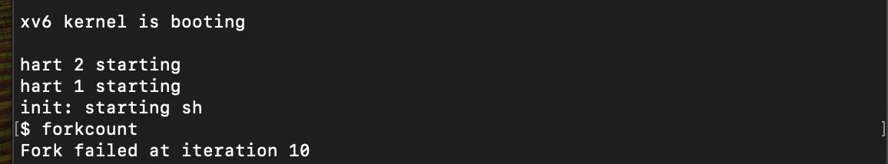

# Project 1: xv6 Customize System Calls
  
**Group:** G14  

## Overview
This repository contains the implementation for Project 1, which focuses on analyzing and modifying the xv6 operating system by adding new system calls. The project demonstrates core OS concepts including process creation, inter-process communication, and signals.

## Contributors
* **Nidhi Mithiya (24JE0664)** - Process Creation Related SystemCalls implementation - 'getppid' & 'forkcount'
* **Nilay Choudhary (24JE0665)** - Signals Implementation
* **PR Sanjit Ram (24JE0666)** - Threads Implementation
* **Paghdal Jeet Prakashkumar (24JE0667)** - `waitpid` & `getchildren` Implementation
* **Parul Sharma (24JE0669)** - Inter-Process Communication (IPC) Implementation
* **Patel Het Alpeshbhai (24JE0670)** - Process Inspection System Calls

---

## Feature 1: Signal Handling
**Implemented by:** Nilay Choudhary (24JE0665)

This feature introduces a software interrupt mechanism allowing asynchronous communication between processes in xv6.

### Core Modifications
* **Process Control Block (`kernel/proc.h`)**: Expanded `struct proc` to include:
  * `pending_signals`: A 32-bit integer acting as a bitmap for pending signals.
  * `signal_handlers[32]`: An array storing user-space memory addresses for registered signal handlers (initialized to `-1` to handle xv6's `0x0` virtual address baseline).
  * `saved_trapframe`: A backup of the process CPU state to allow resumption after signal execution.
  * `handling_signal`: A lock flag to prevent nested signal corruption.
* **Process Allocation (`kernel/proc.c`)**: Updated `allocproc()` to explicitly zero out `pending_signals` and `handling_signal`, and initialize the `signal_handlers` array to `-1` when a new process is created, preventing uninitialized memory bugs.
* **Kernel Internal Declarations (`kernel/defs.h`)**: Added prototype for `ksigsend(int, int)` in the `proc.c` section.

### System Calls Implemented
1. `sys_signal(int signum, void (*handler)())`
   * **Purpose:** Registers a custom function as the handler for a specific signal number.
   * **Mechanism:** Saves the function's memory address into the `signal_handlers` array of the current process.

2. `sys_sigsend(int pid, int signum)`
   * **Purpose:** Delivers a signal from one process to another.
   * **Mechanism:** Iterates through the process table to find the target `pid`, acquires its lock, and flips the corresponding bit in its `pending_signals` bitmap using a bitwise OR operation.

3. `sys_sigreturn(void)`
   * **Purpose:** Restores the process state after a signal handler completes.
   * **Mechanism:** Copies the `saved_trapframe` back into the main `trapframe` and resets the `handling_signal` flag, ensuring the process resumes its main execution loop safely.

### Trap Routing (`kernel/trap.c`)
The signal execution logic is injected into `usertrap()` immediately before `prepare_return()`. If a signal is pending and a valid handler is registered (not equal to `-1`), the kernel backs up the current trapframe, modifies the Exception Program Counter (`epc`) to point to the user's custom handler, and allows the CPU to jump to that function upon returning to user space.

### Supporting Changes
* **`kernel/syscall.h`**: Added syscall numbers `SYS_signal` (22), `SYS_sigsend` (23), and `SYS_sigreturn` (24).
* **`kernel/syscall.c`**: Registered the three new syscall handler functions in the dispatch table.
* **`kernel/sysproc.c`**: Added the argument extraction and delegation logic for `sys_signal`, `sys_sigsend`, and `sys_sigreturn`.
* **`user/usys.pl`**: Added `entry("signal")`, `entry("sigsend")`, and `entry("sigreturn")` to auto-generate the user-space syscall assembly stubs.
* **`user/user.h`**: Exposed `signal()`, `sigsend()`, and `sigreturn()` as callable functions for user programs.

### Testing & Execution
* **Test Program:** `$ testsignals`
* **What the test does:**
  1. Forks a child process.
  2. The child registers a custom handler for signal 10 and enters an infinite while-loop.
  3. The parent pauses briefly, then calls `sigsend()` to deliver signal 10 to the child's PID.
  4. The child intercepts the signal, breaks the loop via the handler, and exits cleanly.
* **Screenshots:** 
---

## Feature 2: `waitpid` and `getchildren` System Calls
**Implemented by:** Paghdal Jeet Prakashkumar (24JE0667)

This feature introduces two new process management system calls that extend xv6's existing `wait()` functionality with more precise control over child process synchronization and inspection.

### Core Modifications
* **Kernel Implementations (`kernel/proc.c`)**: Two new kernel functions were added:
  * `kwaitpid`: Searches the global `proc[]` table for a child matching a specific PID and blocks until that child becomes a ZOMBIE, then collects its exit status and frees its resources via `freeproc()`.
  * `kgetchildren`: Scans the `proc[]` table for all living (non-ZOMBIE, non-UNUSED) children of the calling process and copies their PIDs into a user-space buffer using `copyout()`.

* **Kernel Internal Declarations (`kernel/defs.h`)**: Added prototypes for `kwaitpid(int, uint64)` and `kgetchildren(uint64, int)` in the `proc.c` section so other kernel files can reference them.

* **Syscall Dispatch Table (`kernel/syscall.c`)**: Registered both new syscall handler functions (`sys_waitpid`, `sys_getchildren`) in the `extern` declaration list and in the `syscalls[]` function pointer array at indices 22 and 23.

* **Syscall Numbers (`kernel/syscall.h`)**: Assigned unique numbers:
  * `SYS_waitpid     24`
  * `SYS_getchildren 25`

* **Argument Extraction Layer (`kernel/sysproc.c`)**: Added `sys_waitpid()` and `sys_getchildren()` which read arguments from the process trapframe registers using `argint()` and `argaddr()`, then delegate to the kernel implementations.

* **User-Space Stubs (`user/usys.pl`)**: Added `entry("waitpid")` and `entry("getchildren")` to auto-generate the assembly stubs that load the syscall number into register `a7` and execute the `ecall` instruction.

* **User-Space Interface (`user/user.h`)**: Declared the public prototypes:
  ```c
  int waitpid(int pid, int *status);
  int getchildren(int *buf, int maxn);
  ```

### System Calls Implemented

1. `sys_waitpid(int pid, int *status)`
   * **Purpose:** Waits for a specific child process (identified by `pid`) to exit, rather than waiting for any child like the existing `wait()`.
   * **Mechanism:** Acquires `wait_lock` and loops through the process table searching for a child whose `pid` matches and whose `parent` is the calling process. If the child is already a ZOMBIE, it uses `copyout()` to safely write the exit status to the user-space `status` pointer, calls `freeproc()` to clean up the child's resources, and returns the pid. If the child is still running, it calls `sleep(p, &wait_lock)` to block until any child exits (via `wakeup` triggered inside `kexit()`), then re-checks in a loop.
   * **Return Value:** The waited-on `pid` on success, `-1` if the pid is not a child of the caller or on error.

2. `sys_getchildren(int *buf, int maxn)`
   * **Purpose:** Returns the PIDs of all currently living child processes of the calling process into a user-provided array.
   * **Mechanism:** Acquires `wait_lock` and iterates the entire `proc[]` table. For each entry where `pp->parent == current_process` and the state is neither `UNUSED` nor `ZOMBIE`, the PID is stored in a local kernel buffer. After releasing the lock, `copyout()` transfers up to `maxn` entries to the user-space buffer `buf`.
   * **Return Value:** The total count of living children (may exceed `maxn` if the buffer was too small), or `-1` on a bad user pointer.


### Testing & Execution
* **Test Program:** `$ testproc`
* **What the test does:**
  1. Forks 3 child processes, each sleeping briefly before exiting with a distinct status code (10, 11, 12).
  2. Calls `getchildren()` immediately after forking to capture and print all living child PIDs.
  3. Calls `waitpid()` for each child individually, printing the returned PID and collected exit status.
* **Expected Output:**
  ```
  testproc: forking 3 children
  getchildren returned 3 children: 4 5 6
  child 4 exiting
  child 5 exiting
  child 6 exiting
  waitpid(4) returned 4, exit status = 10
  waitpid(5) returned 5, exit status = 11
  waitpid(6) returned 6, exit status = 12
  testproc done
  ```
* **Screenshots:** 


---

## Feature 3: Process Inspection System Calls
**Implemented by:** Patel Het Alpeshbhai(24JE0670)

This feature introduces two new system calls(getprocinfo( ) & getproccount()) that allow user-space programs to query runtime information about active processes in the xv6 process table.

### Core Modifications
* **Process Info Structure (`kernel/procinfo.h`)**: Introduced a new header defining `struct procinfo`, which serves as the data transfer object between the kernel and user space. It contains:
  * `pid`: The process ID.
  * `state`: The current process state encoded as an integer (0=UNUSED, 1=USED, 2=SLEEPING, 3=RUNNABLE, 4=RUNNING, 5=ZOMBIE).
  * `sz`: The size of the process's memory in bytes.
  * `name[PROC_NAME_MAX]`: The name of the process (up to 16 characters).

### System Calls Implemented
1. `sys_getproccount(void)`
   * **Purpose:** Returns the number of currently active (non-UNUSED) processes in the system.
   * **Mechanism:** Iterates through the entire `proc[]` table in `kernel/proc.c`, acquires each process's lock, checks if its state is not `UNUSED`, and increments a counter. The final count is returned directly as the syscall return value.

2. `sys_getprocinfo(int pid, struct procinfo *info)`
   * **Purpose:** Fills a user-supplied `struct procinfo` buffer with metadata about the process matching the given `pid`.
   * **Mechanism:** Scans the `proc[]` table for a matching `pid` with a non-UNUSED state. On a match, it copies the `pid`, `state`, `sz`, and `name` fields into a kernel-side `struct procinfo`, then uses `copyout()` to safely transfer it to the user-space pointer. Returns `0` on success and `-1` if no matching process is found.

### Supporting Changes
* **`kernel/syscall.h`**: Added syscall numbers `SYS_getproccount` (26) and `SYS_getprocinfo` (27).
* **`kernel/syscall.c`**: Registered the two new syscall handler functions in the dispatch table.
* **`kernel/defs.h`**: Declared the kernel-internal helper functions `kgetproccount()` and `kgetprocinfo()`.
* **`user/usys.pl`**: Added `entry("getproccount")` and `entry("getprocinfo")` to auto-generate the user-space syscall stubs.
* **`user/user.h`**: Exposed `getproccount()` and `getprocinfo()` as callable functions for user programs.

### Testing & Execution
* **Test Program:** `$ proctest`
* The test program calls `getproccount()` to display the number of active processes, then calls `getprocinfo()` on its own PID to print its name, state, and memory size, and finally verifies that `getprocinfo(9999, ...)` correctly returns `-1` for a non-existent process.
* **Screenshots:** 

---

## Feature 4: Inter-Process Communication (IPC)
**Implemented by:** Parul Sharma

This feature adds a small message-passing interface to xv6 so one process can send a short payload to another and block until a reply is received.

### Core Modifications
* **Process Control Block (`kernel/proc.h`)**: Added a lightweight per-process mailbox with a readiness flag, message length, and fixed-size message buffer.
* **Process Allocation (`kernel/proc.c`)**: Initialized the mailbox state in `allocproc()` and cleared it when a process is freed.
* **Kernel Internal Declarations (`kernel/defs.h`)**: Added prototypes for `kipc_send(int, uint64, int)` and `kipc_recv(uint64, int)`.

### System Calls Implemented
1. `sys_ipc_send(int pid, const void *buf, int n)`
  * **Purpose:** Sends a short message from the current process to the process identified by `pid`.
  * **Mechanism:** Copies up to 64 bytes from user space, stores the payload in the target process mailbox, marks it ready, and wakes the receiver if it is sleeping.

2. `sys_ipc_recv(void *buf, int n)`
  * **Purpose:** Receives a pending message from the calling process mailbox.
  * **Mechanism:** Sleeps until a message is available, copies the payload to the user buffer, clears the mailbox state, and returns the number of bytes copied.

### Supporting Changes
* **`kernel/syscall.h`**: Added syscall numbers `SYS_ipc_send` (34) and `SYS_ipc_recv` (35).
* **`kernel/syscall.c`**: Registered the new IPC syscall handlers in the dispatch table.
* **`kernel/sysproc.c`**: Added wrappers that extract syscall arguments and delegate to the kernel IPC helpers.
* **`user/usys.pl`**: Added `entry("ipc_send")` and `entry("ipc_recv")` to auto-generate user-space stubs.
* **`user/user.h`**: Exposed `ipc_send()` and `ipc_recv()` to user programs.

### Testing & Execution
* **Test Program:** `$ ipctest`
* **What the test does:**
  1. Prints a banner, active process count, and the parent PID.
  2. Forks a child, prints process info for both sides, and shows the child waiting for a message.
  3. The parent sends a message, the child prints the payload, then replies back.
  4. The parent prints the reply and the demo ends with a success banner.
* **Screenshots:** 

---

## Feature 5: Threading Functionality
**Implemented by:** PR Sanjit Ram (24JE0666)

This feature introduces threading capabilities to xv6, allowing multiple threads to execute concurrently within a single process, enabling better resource utilization and parallel execution.

### Core Modifications
* **Thread Structure (`kernel/thread.h`)**: Added a new thread structure to manage thread-specific information including thread ID, stack, and state.
* **Process Control Block Updates (`kernel/proc.h`)**: Extended the process structure to maintain a list of threads associated with each process.
* **Scheduler Modifications (`kernel/proc.c`)**: Updated the scheduler to handle thread scheduling alongside process scheduling.

### System Calls Implemented
1. `sys_thread_create(void (*start_routine)(void*), void *arg)`
   * **Purpose:** Creates a new thread within the current process.
   * **Mechanism:** Allocates thread resources, sets up the thread's stack and context, and adds it to the process's thread list.

2. `sys_thread_join(int tid)`
   * **Purpose:** Waits for a specific thread to complete execution.
   * **Mechanism:** Blocks the calling thread until the specified thread terminates, then cleans up thread resources.

3. `sys_thread_exit(void)`
   * **Purpose:** Terminates the calling thread.
   * **Mechanism:** Marks the thread as terminated and schedules cleanup.

### Supporting Changes
* **Thread Management (`kernel/thread.c`)**: New file containing thread creation, scheduling, and cleanup functions.
* **Trap Handling (`kernel/trap.c`)**: Updated to handle thread-specific traps and context switching.
* **User-Space Library (`user/thread.h` and `user/thread.c`)**: Provides user-level threading API.

### Testing & Execution
* **Test Program:** `$ threadtest`
* The test program demonstrates thread creation, execution, and synchronization by creating multiple threads that perform concurrent tasks.
* **Screenshots:** 
  

## Feature 6: Process Creation Control and Lineage (`getppid` & `forkcount`)
**Implemented by:** Nidhi Mithiya (24JE0664)

This feature introduces process lineage tracking by allowing a process to query its parent's PID, and implements resource control by modifying the core `fork()` system call to limit the maximum number of child processes a single parent can spawn, preventing fork bombs.

### Core Modifications
* **Process Control Block (`kernel/proc.h`)**: Expanded `struct proc` to include:
  * `child_count`: An unsigned integer field used to track the total number of child processes spawned by a specific parent process.
* **Process Allocation (`kernel/proc.c`)**: Updated `allocproc()` to initialize the `child_count` variable to `0` whenever a new process is created. 
* **Fork Modification (`kernel/proc.c`)**: Altered the core `fork()` function logic to enforce a strict limit on process creation. Before allocating memory for a new child, it checks if the parent's `child_count` has reached the predefined limit (10). If the limit is reached, it denies the fork and returns `-1`. Otherwise, it increments the parent's `child_count` and proceeds with the standard `uvmcopy` and memory allocation.

### System Calls Implemented
1. `sys_getppid(void)`
   * **Purpose:** Retrieves the Process ID (PID) of the calling process's parent.
   * **Mechanism:** Accesses the current process via `myproc()`. It verifies that a parent exists (`myproc()->parent`), and if so, returns `myproc()->parent->pid`.

### Supporting Changes
* **`kernel/syscall.h`**: Added the syscall number for `SYS_getppid`.
* **`kernel/syscall.c`**: Registered the `sys_getppid` function in the syscall dispatch table.
* **`kernel/sysproc.c`**: Added the wrapper logic for `sys_getppid` to interact with user-space.
* **`user/usys.pl`**: Added `entry("getppid")` to generate the assembly stub.
* **`user/user.h`**: Exposed `getppid(void)` as a callable function for user programs.

### Testing & Execution
* **Test Program 1:** `$ ppid`
  * **What the test does:** Calls `getpid()` to print its own PID, then calls `getppid()` to print the parent's PID.
  * **Result:** Output successfully maps child to parent (e.g., My PID: 3, My Parent PID: 2).
* **Test Program 2:** `$ forkcount`
  * **What the test does:** Attempts to continuously execute `fork()` in a loop to spawn multiple child processes, testing the resource limit modifications made in `proc.c`.
  * **Result:** Successfully blocks creation after hitting the threshold, outputting `Fork failed at iteration 10`.
* **Screenshots:** * 
  * 
