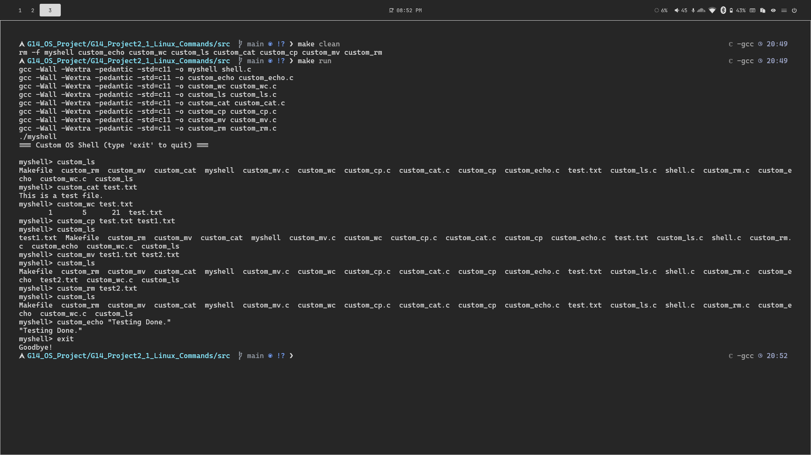

# Project 2: Custom UNIX-Like Shell and Utilities

**Group:** G14  

## Overview
This repository contains the implementation for Project 2 (Option 1). We have developed a custom, lightweight UNIX-like shell (`myshell`) alongside a suite of simplified command-line utilities. Each utility is compiled as a standalone executable and is invoked by the main shell program using multi-processing system calls.

## Contributors
* **Nilay Choudhary (24JE0665)** - Implemented `custom_cp` and `custom_mv`.
* **Patel Het Alpeshbhai (24JE0670)** - Implemented `custom_wc`.
* **Paghdal Jeet Prakashkumar (24JE0667)** - Implemented `custom_echo`.
* **Nidhi Mithiya (24JE0664) ** - Implemented 'custom_ls' and 'custom_cat'
* **[Teammate 5 Name]** - 

---

## Build and Execution Instructions
We have provided a robust `Makefile` to handle compilation.

**To compile all binaries:**
```bash
make clean
make
```

**To compile and immediately launch the shell:**
```bash
make run
```

Once inside the shell (`myshell>`), you can type commands like `custom_cp source.txt dest.txt` or type `exit` to terminate the shell.

---

## Core Architecture: The Custom Shell (`myshell`)
The shell operates in a continuous loop, parsing user input into arguments. When a recognized custom command is entered, the shell uses the following process control system calls:
1. `fork()`: Creates a child process.
2. `execv()`: The child process replaces its memory space with the compiled binary of the requested custom utility (e.g., `./custom_cp`).
3. `waitpid()`: The parent shell process waits for the child process to terminate before returning the `myshell>` prompt to the user.

---

## Utilities Implemented

### 1. File Copying: `custom_cp`
**Implemented by:** Nilay Choudhary (24JE0665)
* **Usage:** `custom_cp <source> <destination>`
* **Description:** Reads a source file and duplicates its contents into a destination file.
* **System Calls:** Uses `open()`, `read()`, `write()`, and `close()`.
* **Details:** Opens the source file in `O_RDONLY`. Opens the destination file using `O_WRONLY | O_CREAT | O_TRUNC` with `0644` permissions, meaning it will create the file if it doesn't exist, and silently overwrite (truncate) it if it does. Data is processed in 4096-byte buffer chunks.

### 2. File Moving/Renaming: `custom_mv`
**Implemented by:** Nilay Choudhary (24JE0665)
* **Usage:** `custom_mv <source> <destination>`
* **Description:** Moves or renames a file within the filesystem.
* **System Calls:** Uses the POSIX `rename()` system call.
* **Details:** Atomically updates the directory link. If the destination path already exists as a regular file, it is overwritten.

### 3. File Concatenation: `custom_cat`
**Implemented by:** Nidhi Mithiya (24JE0664)
* **Usage:** `custom_cat <filename> [filename2] ...`
* **Description:** Opens the specified file(s), reads the contents, and prints them sequentially to the standard output.
* **System Calls:** Uses POSIX system calls `open()`, `read()`, `write()`, and `close()`.
* **Details:** Processes files in a loop to allow multiple arguments. Opens each file in `O_RDONLY` mode. Uses a robust 4096-byte buffer in a `while` loop to efficiently read data chunks and write them directly to `STDOUT_FILENO`. Includes standard error handling to skip invalid files without crashing the shell.

### 4. Directory Listing: `custom_ls`
**Implemented by:** Nidhi Mithiya (24JE0664)
* **Usage:** `custom_ls [directory]`
* **Description:** Lists the file and directory contents of the specified path. Defaults to the current working directory if no path is provided.
* **System Calls:** Uses `<dirent.h>` library functions `opendir()`, `readdir()`, and `closedir()`.
* **Details:** Opens a directory stream and iterates through the `dirent` structures. Replicates standard `ls` behavior by actively checking the first character of `d_name` and filtering out hidden system files (those beginning with a `.`). Formats the output with clean spacing before safely closing the directory stream.

### 5. Word Count: `custom_wc`
**Implemented by:** Patel Het Alpeshbhai(24JE0670)
* **Usage:** `custom_wc <filename>`
* **Description:** Counts the number of lines, words, and characters in a file.
* **System Calls:** Uses `open()`, `read()`, and `close()`.
* **Details:** Opens the file in `O_RDONLY` and reads it in 4096-byte buffer chunks. Iterates over each character to count newlines (lines), whitespace-delimited tokens (words), and total bytes (characters). Prints results in the format `lines words chars filename`.

### 6. Echo: `custom_echo`
**Implemented by:** Paghdal Jeet Prakashkumar (24JE0667)
* **Usage:** `custom_echo [OPTION]... [STRING]...`
* **Description:** Prints the provided string(s) to standard output with optional escape sequence support.
* **System Calls:** Uses `fputs()` and `putchar()` for output.
* **Details:** Supports `-n` to suppress the trailing newline, `-e` to enable backslash escape interpretation (`\n`, `\t`, `\r`, `\a`, `\b`, `\\`, `\0NNN` octal), and `-E` to disable escapes (default). Combined flags like `-ne` are supported. Unknown flags are treated as string arguments.

---

## Proof of Execution

```
